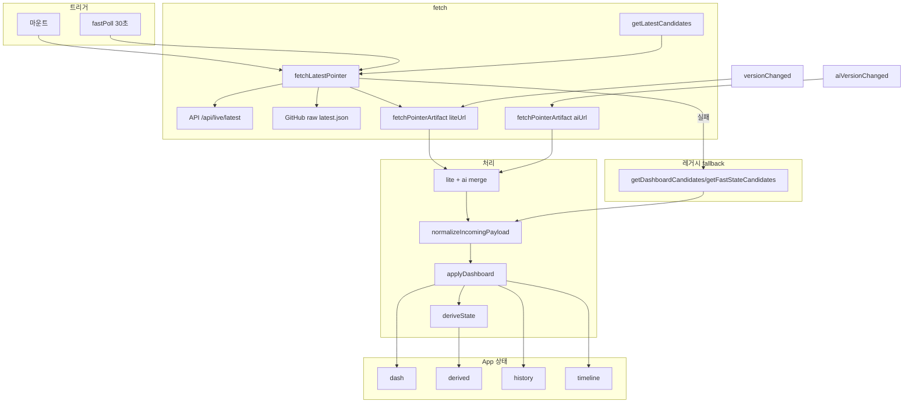

# UrgentDash Components

HyIE ERC² 대시보드 React 컴포넌트 문서.

---

## 1. 개요

| 컴포넌트/훅 | 경로 | 역할 |
|-------------|------|------|
| useDashboardData | `react/src/hooks/useDashboardData.js` | 데이터 획득·폴링·history/timeline·오프라인·알림·사운드·export |
| App | `react/src/App.jsx` | 얇은 셸 (useDashboardData + 탭 라우팅) |
| DashboardHeader | `react/src/components/DashboardHeader.jsx` | 헤더, Pill, Refresh, 알림/사운드 토글, 오프라인 배너 |
| TabBar | `react/src/components/TabBar.jsx` | 탭 버튼 바 |
| ShortcutsOverlay | `react/src/components/ShortcutsOverlay.jsx` | 키보드 단축키 가이드 |
| HistoryPlayback | `react/src/components/HistoryPlayback.jsx` | 히스토리 시점 선택·비교 |
| OverviewTab | `react/src/components/tabs/OverviewTab.jsx` | Gauge, Likelihood, Conflict Stats, 루트 요약 |
| AnalysisTab | `react/src/components/tabs/AnalysisTab.jsx` | MultiLineChart, Sparkline, TimelinePanel, HistoryPlayback |
| IntelTab | `react/src/components/tabs/IntelTab.jsx` | Intel Feed 필터·카드 목록 |
| IndicatorsTab | `react/src/components/tabs/IndicatorsTab.jsx` | 지표 카드, Evidence Floor |
| RoutesTab | `react/src/components/tabs/RoutesTab.jsx` | RouteMapLeaflet, 루트 상세 카드 |
| ChecklistTab | `react/src/components/tabs/ChecklistTab.jsx` | 대피 체크리스트 |
| Card, Pill, Bar, Gauge | `react/src/components/ui.jsx` | 재사용 UI |
| Sparkline, MultiLineChart | `react/src/components/charts.jsx` | 차트 |
| TimelinePanel | `react/src/components/TimelinePanel.jsx` | 이벤트 타임라인 |
| RouteMapLeaflet | `react/src/components/RouteMapLeaflet.jsx` | Leaflet 기반 루트 맵 |
| Simulator | `react/src/components/Simulator.jsx` | 시나리오 시뮬레이터 |

---

## 2. 데이터 흐름 아키텍처

**데이터 획득 프로세스** (useDashboardData.js)



**주요 흐름** (useDashboardData.js):
- `getLatestCandidates()` → `fetchLatestPointer(candidates)` 30초 poll
- `version` 변경 시 `fetchPointerArtifact(liteUrl)` → `state-lite.json`
- `aiVersion` 변경 시 `fetchPointerArtifact(aiUrl)` → `state-ai.json` merge
- 실패 시 레거시 `getDashboardCandidates` / `getFastStateCandidates` fallback
- 오프라인 시 `loadCachedDash()` (offlineCache.js, IndexedDB)
- applyDashboard: `deriveState` → `appendHistory` → `buildDiffEvents` → `mergeTimelineWithNoiseGate`

**livePointer.js 호환**  
구형 `latest.json` 포맷(`litePath`, `publishedAt`, `lite_path` 등)도 `normalizeLatestPointer`에서 처리.

---

## 3. 데이터 소스 분류표

| 소스 | 타입 | 갱신 | 비고 |
|------|------|------|------|
| latest.json | 외부 | 30초 poll | `getLatestCandidates` → `fetchLatestPointer` |
| state-lite.json, state-ai.json | 외부 | version/aiVersion 변경 시 | `fetchPointerArtifact` (livePointer.js) |
| API / GitHub raw | 외부 | 레거시 fallback | `getDashboardCandidates` |
| dash | 상태 | fetch 시 | intelFeed, indicators, hypotheses, routes, checklist, metadata |
| derived | 파생 | dash 변경 시 | `deriveState(dash, egress)`, `staleSeverity` (35m/60m/120m) |
| history | 상태 | appendHistory | localStorage 동기화, 최대 96 |
| timeline | 상태 | buildDiffEvents, logEvent | localStorage 동기화, 최대 220 |
| egressLossETA | 상태 | dash.metadata 또는 localStorage | 사용자 수동 저장 |
| offlineCache | 캐시 | IndexedDB | 오프라인 시 `loadCachedDash` |
| KEY_ASSUMPTIONS | 상수 | **고정** | hyieLegacyContent.js |
| I02_SEGMENTS, ROUTE_BUFFER_FACTOR 등 | 상수 | **고정** | constants.js |
| INITIAL_DASHBOARD | fallback | **고정** | fetch 실패 시 사용 |

---

## 4. 페이지별 컴포넌트·데이터·로직

### 4.1 Overview 탭

| 컴포넌트/요소 | 데이터 소스 | 고정/업데이트 | 작동 로직 |
|---------------|-------------|---------------|-----------|
| Pill (MODE, Gate, I02) | derived | 업데이트 | deriveState: gateState(I01/I03/I04·triggers), modeState(degraded/ds/triggers), airspaceState(I02) |
| Gauge (EvidenceConf, ΔScore, Urgency) | derived | 업데이트 | ec, ds, urgencyScore(egress 기반) |
| Likelihood | derived | 업데이트 | H2 score → likelihoodLabel, likelihoodBand, likelihoodBasis |
| Top routes | dash.routes, derived | 업데이트 | usableRoutes = routes 필터·정렬, eff = base_h × (1+cong) × ROUTE_BUFFER_FACTOR |
| Conflict Stats | derived.conflictStats | 업데이트 | normalizeConflictStats(metadata.conflictStats) |
| Key Assumptions | KEY_ASSUMPTIONS | **고정** | import 상수, map으로 렌더 |
| aiAnalysis (조건부) | dash.aiAnalysis | 업데이트 | payload에 있으면 표시 |
| AI-ish Summary | buildOfflineSummary(dash, derived) | 업데이트 | autoSummary ON 시 dash 변경 시 재생성 |

### 4.2 Analysis 탭

| 컴포넌트 | 데이터 소스 | 고정/업데이트 | 작동 로직 |
|----------|-------------|---------------|-----------|
| MultiLineChart | history | 업데이트 | histH0/H1/H2 = history.map(scores), appendHistory로 누적 |
| Sparkline (ΔScore, EC) | history | 업데이트 | histDs, histEc |
| TimelinePanel | timeline | 업데이트 | buildDiffEvents로 diff 누적, logEvent로 수동 추가, Clear/Export |

### 4.3 Intel 탭

| 컴포넌트 | 데이터 소스 | 고정/업데이트 | 작동 로직 |
|----------|-------------|---------------|-----------|
| 필터 버튼 (ALL/CRITICAL/HIGH/MEDIUM) | intelFilter (로컬) | 사용자 선택 | 카운트: 전체 feed 기준, 렌더: 필터 결과 기준 |
| Intel 카드 목록 | dash.intelFeed | 업데이트 | allIntelFeed(카운트), filteredIntelFeed(렌더) |

### 4.4 Indicators 탭

| 컴포넌트 | 데이터 소스 | 고정/업데이트 | 작동 로직 |
|----------|-------------|---------------|-----------|
| Indicator 카드 | dash.indicators | 업데이트 | Bar(value=state), tier/state/detail/cv 등 normalize |
| Evidence Floor | derived | 업데이트 | evidenceFloorT0, evidenceFloorPassed |

### 4.5 Routes 탭

| 컴포넌트 | 데이터 소스 | 고정/업데이트 | 작동 로직 |
|----------|-------------|---------------|-----------|
| RouteMapLeaflet | dash.routes, dash.routeGeo | 업데이트 | routeGeo 없으면 DEFAULT_ROUTE_GEO, OSRM/Mapbox로 geometry fetch |
| Route 상세 카드 | dash.routes | 업데이트 | status, base_h, cong, effective 계산 |
| selectedRouteId | 로컬 state | 사용자 선택 | 클릭 시 하이라이트 |

### 4.6 Simulator 탭

| 컴포넌트 | 데이터 소스 | 고정/업데이트 | 작동 로직 |
|----------|-------------|---------------|-----------|
| 초기값 | liveDash | 업데이트 | buildInitialSim: hypotheses, indicators, routes, metadata에서 복사 |
| 슬라이더/체크박스 | sim (로컬 state) | 사용자 입력 | update(path, value), toggleTrig |
| 파생 상태 | simDash, simDerived | 시뮬레이션 | buildDashFromSim → deriveState, Log로 timeline에 기록 (dash 미반영) |

### 4.7 Checklist 탭

| 컴포넌트 | 데이터 소스 | 고정/업데이트 | 작동 로직 |
|----------|-------------|---------------|-----------|
| 체크리스트 항목 | dash.checklist | 업데이트 | mergeChecklist: payload 새 항목 + prev done 유지 |
| done | 로컬 (merge) | 사용자 + fetch | 체크 시 로컬 유지, fetch 시 payload structure 병합 |

---

## 5. ui.jsx

### 5.1 Card

섹션 래퍼. children을 카드 스타일로 감쌈.

**데이터 소스** N/A (UI 래퍼) · **고정/업데이트** 고정

**Props**

| prop | 타입 | 기본값 | 설명 |
|------|------|--------|------|
| children | ReactNode | - | 자식 요소 |
| style | object | - | 추가 인라인 스타일 (merge) |

**스타일**  
`background #0f172a`, `border 1px solid #334155`, `borderRadius 14`, `padding 16`, `marginBottom 12`

**사용 예**

```jsx
<Card>
  <div>내용</div>
</Card>
<Card style={{ marginBottom: 0 }}>
  ...
</Card>
```

---

### 5.2 Pill

라벨+값 조합 배지. MODE, Gate, I02 등 상태 표시용.

**데이터 소스** derived · **고정/업데이트** 업데이트

**Props**

| prop | 타입 | 기본값 | 설명 |
|------|------|--------|------|
| label | string | - | 라벨 (예: "MODE") |
| value | string | - | 값 (예: "SHELTER") |
| color | string | `#94a3b8` | 값 색상 |

**스타일**  
`display flex`, `background #0b1220`, `border 1px solid #1e293b`, `borderRadius 999`, `padding 6px 10px`  
label: `fontSize 10`, `color #64748b`, `fontWeight 800`  
value: `fontSize 11`, `fontWeight 900`, `fontFamily monospace`

**사용 예**

```jsx
<Pill label="MODE" value={derived.modeState} color={derived.modeColor} />
<Pill label="Gate" value="CAUTION" color="#f59e0b" />
```

---

### 5.3 Bar

0~1 비율 진행률 바.

**데이터 소스** dash.indicators (또는 derived) · **고정/업데이트** 업데이트

**Props**

| prop | 타입 | 기본값 | 설명 |
|------|------|--------|------|
| value | number | 0 | 0~1 진행률 |
| color | string | `#22c55e` | 채우기 색상 |
| h | number | 8 | 높이(px) |

**스타일**  
트랙: `background #111827`, `border 1px solid #1e293b`, `borderRadius 999`  
채우기: `width ${value*100}%`, `background color`

**사용 예**

```jsx
<Bar value={0.75} color="#22c55e" />
<Bar value={ind.state} color={ind.state >= 0.8 ? "#ef4444" : "#22c55e"} h={6} />
```

---

### 5.4 Gauge

반원 게이지. EvidenceConf, ΔScore, Urgency 등 0~1 값 표시.

**데이터 소스** derived · **고정/업데이트** 업데이트

**Props**

| prop | 타입 | 기본값 | 설명 |
|------|------|--------|------|
| value | number | 0 | 0~1 값 |
| label | string | `""` | 하단 라벨 |
| sub | string | `""` | 보조 텍스트 (선택) |

**동작**

- value가 0~1로 clamp
- 색상: v≥0.8 → `#ef4444`, v≥0.4 → `#f59e0b`, else `#22c55e`
- SVG 반원 arc: cx 45, cy 52, r 28, 180도 기준

**사용 예**

```jsx
<Gauge value={derived.ec} label="EvidenceConf" sub={`thr=${derived.effectiveThreshold.toFixed(2)}`} />
<Gauge value={derived.urgencyScore} label="Urgency" sub={`egress=${egressLossETA}h`} />
```

---

## 6. charts.jsx

### 6.1 Sparkline

단일 시계열 데이터를 선 그래프로 표시.

**데이터 소스** history · **고정/업데이트** 업데이트

**Props**

| prop | 타입 | 기본값 | 설명 |
|------|------|--------|------|
| data | number[] | `[]` | 시계열 데이터 |
| min | number | 0 | Y축 최소 |
| max | number | 1 | Y축 최대 |
| color | string | `#60a5fa` | 선 색상 |
| height | number | 44 | 높이(px) |

**스타일**  
viewBox `0 0 220 44`, 배경 `#0b1220`, stroke `#1e293b`, rx 10  
path: `strokeWidth 2.4`, `opacity 0.95`

**사용 예**

```jsx
<Sparkline data={histDs} min={-0.2} max={0.6} color="#60a5fa" />
<Sparkline data={histEc} color="#22c55e" />
```

---

### 6.2 MultiLineChart

여러 시계열을 한 차트에 그리기. H0, H1, H2 등 가설 추이용.

**데이터 소스** history · **고정/업데이트** 업데이트

**Props**

| prop | 타입 | 기본값 | 설명 |
|------|------|--------|------|
| series | Array | `[]` | `{ id, label, color, data }[]` |
| min | number | 0 | Y축 최소 |
| max | number | 1 | Y축 최대 |
| height | number | 160 | 높이(px) |

**series 항목**

| 필드 | 타입 | 설명 |
|------|------|------|
| id | string | 시리즈 식별자 |
| label | string | 라벨 |
| color | string | 선 색상 |
| data | number[] | 시계열 |

**스타일**  
viewBox `0 0 560 160`, gridY 0.25/0.5/0.75, 마지막 점 circle r 3.6

**사용 예**

```jsx
<MultiLineChart
  height={160}
  min={0}
  max={1}
  series={[
    { id: "H0", label: "H0", color: "#22c55e", data: histH0 },
    { id: "H1", label: "H1", color: "#f59e0b", data: histH1 },
    { id: "H2", label: "H2", color: "#ef4444", data: histH2 }
  ]}
/>
```

---

## 7. TimelinePanel

이벤트 로그(타임라인) 표시. level별 색상, 필터 없음.

**데이터 소스** timeline · **고정/업데이트** 업데이트

**timeline 채우는 흐름**  
`buildDiffEvents(dash, prevDash)`로 dash 변경 시 diff 이벤트 누적 → `mergeTimelineWithNoiseGate`로 노이즈 제거 후 timeline에 반영. `logEvent(ev)`로 사용자/시뮬레이터가 수동 추가. Clear/Export로 제어.

**Props**

| prop | 타입 | 기본값 | 설명 |
|------|------|--------|------|
| timeline | Array | `[]` | 이벤트 배열 |
| onClear | function | - | Clear 클릭 핸들러 |
| onExport | function | - | Export 클릭 핸들러 |

**이벤트 구조**

| 필드 | 타입 | 설명 |
|------|------|------|
| id | string | 고유 ID |
| level | string | ALERT, WARN, INFO, SYSTEM |
| category | string | SYSTEM, MODE, GATE 등 |
| title | string | 제목 |
| detail | string | 상세 (선택) |
| ts | string | ISO 시각 |

**LEVEL_COLORS**  
ALERT `#ef4444`, WARN `#f59e0b`, INFO `#22c55e`, SYSTEM `#94a3b8`

**사용 예**

```jsx
<TimelinePanel
  timeline={timeline}
  onClear={() => setTimeline([])}
  onExport={exportTimeline}
/>
```

---

## 8. RouteMapLeaflet

Leaflet 기반 루트 맵. OSRM/Mapbox로 도로 geometry 조회 후 Polyline 그리기.

**데이터 소스** dash.routes, dash.routeGeo · **고정/업데이트** 업데이트

**geometry fetch 순서**  
`fetchRouteGeometryCached` → OSRM 우선, Mapbox 대체, fallback(routeGeo 없으면 DEFAULT_ROUTE_GEO) 순으로 시도.

**Props**

| prop | 타입 | 기본값 | 설명 |
|------|------|--------|------|
| routes | Array | `[]` | 루트 목록 `{ id, status, base_h, cong }` |
| routeGeo | object | null | 노드/waypoints (없으면 DEFAULT_ROUTE_GEO) |
| selectedId | string | null | 선택된 루트 ID |
| onSelect | function | `()=>{}` | 루트/맵 클릭 시 `(routeId|null)` 호출 |

**의존성**

- `react-leaflet`, `leaflet`
- `routeApi.js`: `fetchRouteGeometryCached`, `resolveRouteWaypoints`
- `routeGeoDefault.js`: `DEFAULT_ROUTE_GEO`
- `VITE_LEAFLET_TILES_URL`, `VITE_MAPBOX_TOKEN` (env)

**Polyline**  
status별 color, BLOCKED 시 opacity 0.65, CAUTION 시 dashArray `10 8`  
선택 시 weight 7, 기본 5

**사용 예**

```jsx
<RouteMapLeaflet
  routes={dash.routes || []}
  routeGeo={routeGeo}
  selectedId={selectedRouteId}
  onSelect={setSelectedRouteId}
/>
```

---

## 9. Simulator

가설·지표·루트 파라미터를 조정하고 파생 상태를 실시간 확인.

**데이터 소스** liveDash (초기화), sim 로컬 state (편집) · **고정/업데이트** liveDash 기반 초기화

**동작 요약**  
초기값은 `buildInitialSim(liveDash)`로 hypotheses, indicators, routes, metadata에서 복사. 사용자 조정 시 `buildDashFromSim` → `deriveState`로 simDash/simDerived 계산. **시뮬레이션 결과는 dash에 반영하지 않음.** Log 클릭 시 onLog로 event 전달 → timeline에만 기록.

**Props**

| prop | 타입 | 기본값 | 설명 |
|------|------|--------|------|
| liveDash | object | - | 현재 대시보드 데이터 |
| onLog | function | `()=>{}` | Log 클릭 시 `(event)` 호출 |

**내부 상태**

- hypotheses: H0, H1, H2 (0~1)
- indicators: I01~I04 (0~1)
- triggers: kr_leave_immediately, strike_detected, border_change, red_imminent
- degraded: boolean
- egressLossETA, evidenceConf, effectiveThreshold, deltaScore
- routes: id, status, cong, base_h

**출력**

- `simDash`: 시뮬레이터에서 만든 대시보드
- `simDerived`: deriveState(simDash) 결과  
  → MODE, Gate, Airspace, Evidence, 추천 루트 표시

**사용 예**

```jsx
<Simulator
  liveDash={dash}
  onLog={(ev) => logEvent(ev)}
/>
```

---

## 10. App.jsx에서의 사용

App.jsx는 얇은 셸이며 `useDashboardData`와 탭 컴포넌트만 조합한다.

| 탭 | 탭 컴포넌트 | 내부 사용 |
|----|-------------|-----------|
| overview | OverviewTab | Card, Gauge, Pill, Bar |
| analysis | AnalysisTab | MultiLineChart, Sparkline, TimelinePanel, HistoryPlayback |
| intel | IntelTab | Card |
| indicators | IndicatorsTab | Card, Bar |
| routes | RoutesTab | RouteMapLeaflet, Card |
| sim | Simulator | Card |
| checklist | ChecklistTab | Card |

---

## 11. 관련 문서

- [LAYOUT.md](./LAYOUT.md)
- [SYSTEM_ARCHITECTURE.md](./SYSTEM_ARCHITECTURE.md)
- [의존성.md](./의존성.md)
