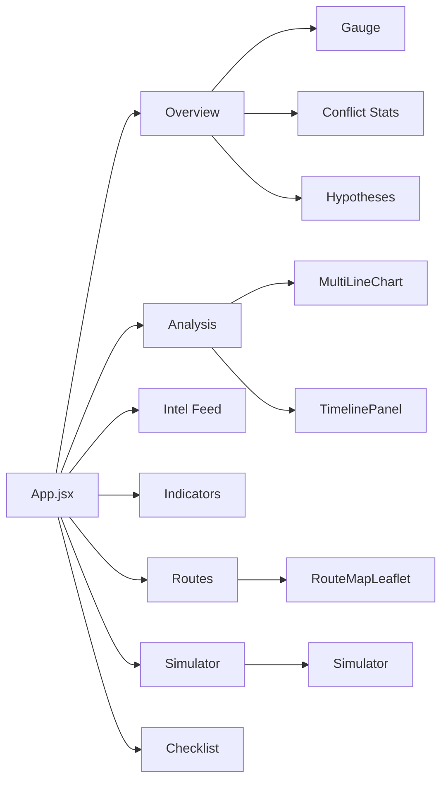
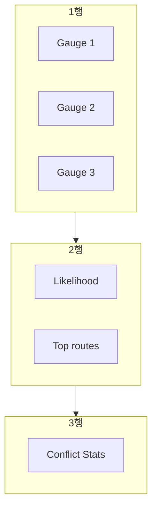

# UrgentDash Layout

HyIE ERC² 대시보드 UI 레이아웃 및 컴포넌트 구성.

---

## 1. 전체 레이아웃

### 1.1 루트 컨테이너

| 속성 | 값 | 파일 |
|------|-----|------|
| 최소 높이 | `100vh` | styles.css `.dash-container` |
| 패딩 | `12px` | styles.css `.dash-container` |
| 최대 너비 | `980px` | styles.css `.dash-container` |
| 정렬 | `margin: 0 auto` (중앙) | styles.css `.dash-container` |

### 1.2 색상 팔레트

| 역할 | 색상 |
|------|------|
| 배경 body | `#020617` |
| 카드 배경 | `#0b1220`, `#0f172a` |
| 보더 | `#1e293b`, `#334155` |
| 텍스트 기본 | `#e2e8f0` |
| 텍스트 보조 | `#94a3b8` |
| 텍스트 흐림 | `#64748b`, `#475569` |
| BLOCKED / 에러 | `#ef4444`, `#7f1d1d`, `#fca5a5` |
| CAUTION / 경고 | `#f59e0b`, `#92400e`, `#fbbf24`, `#fcd34d` |
| OPEN / 정상 | `#22c55e` |
| 링크 | `#93c5fd`, `#bfdbfe` (hover) |
| 링크/강조 | `#60a5fa` |
| 탭 active 보더 | `#60a5fa` |
| Key Assumptions warn | `rgba(245,158,11,0.06)` 배경, `#92400e` 보더 |
| 헤더 그라데이션 | `linear-gradient(135deg,#0f172a,#1e1b4b)` |
| 에러 박스 | `rgba(239,68,68,0.10)` 배경, `#7f1d1d` 보더 |

### 1.3 글로벌 스타일 (ui/index_v2.html)

| 속성 | 값 |
|------|-----|
| body background | `#020617` |
| font-family | `Inter`, `-apple-system`, `system-ui`, `sans-serif` |
| a | color `#93c5fd`, hover `#bfdbfe` |
| selection | background `rgba(245,158,11,0.25)` |

---

## 2. 탭 구조

| ID | 라벨 | 아이콘 | 설명 |
|----|------|--------|------|
| overview | Overview | 📊 | 요약, 가설, 루트 요약 |
| analysis | Trends & Log | 📈 | 차트, 타임라인 |
| intel | Intel Feed | 🔴 | 인텔 피드 |
| indicators | Indicators | 📡 | 지표 I01~I07 |
| routes | Routes | 🗺️ | 루트 맵, 상세 |
| sim | Simulator | 🧪 | 시뮬레이터 |
| checklist | Checklist | ✅ | 대피 체크리스트 |

---

## 3. Mermaid 레이아웃 다이어그램

### 3.1 탭 구조

### 3.2 Overview 섹션 그리드

---

## 4. 섹션별 레이아웃

### 4.1 헤더 영역 (DashboardHeader.jsx)

- `display: flex`, `justify-content: space-between`, `flex-wrap: wrap`
- 좌측: 제목, GST, last fetch, full sync 정보
- 우측: Pill (MODE, Gate, I02), Refresh 버튼, 알림/사운드 토글
- 오프라인 시: 캐시 사용 배너 표시

### 4.2 Overview 탭

| 블록 | grid/flex | 구성 |
|------|-----------|------|
| Gauge 3열 | `grid 1fr 1fr 1fr`, gap 10 | EvidenceConf, ΔScore, Urgency |
| 하단 2열 | `grid 1fr 1fr` | Likelihood / Top routes |
| Conflict Stats | `repeat(auto-fit, minmax(190px, 1fr))` | Missiles, Drones, Casualties, Duration |
| Key Assumptions | `repeat(auto-fit, minmax(260px, 1fr))` | 가정 카드 |
| Hypotheses | `repeat(auto-fit, minmax(260px, 1fr))` | H0, H1, H2 |
| ΔScore / EvidenceConf trend | `grid 1fr 1fr` | 스파크라인 |

### 4.3 Routes 탭

- 2열: `grid 1.15fr 0.85fr`
- 좌: Route Map (SVG 또는 Leaflet)
- 우: Route 상세 카드 (status, base_h, congestion, effective_h, newsRefs)

### 4.4 Simulator 탭

- `grid 1.15fr 0.85fr`
- 좌: 파라미터 (routes, congestion, base_h, buffer)
- 우: 결과 (effective 시간, 선택 루트)

### 4.5 Checklist 탭

- `flex flexDirection: column`, gap 8
- 체크박스 리스트: id, text, done

---

## 5. 컴포넌트 상세 스펙

### 5.1 Card (ui.jsx)

| 속성 | 값 |
|------|-----|
| background | `#0f172a` |
| border | `1px solid #334155` |
| borderRadius | 14 |
| padding | 16 |
| marginBottom | 12 |

### 5.2 Pill (ui.jsx)

| 속성 | 값 |
|------|-----|
| display | flex, alignItems center, gap 8 |
| background | `#0b1220` |
| border | `1px solid #1e293b` |
| borderRadius | 999 |
| padding | 6px 10px |
| label | fontSize 10, color #64748b, fontWeight 800 |
| value | fontSize 11, color (props), fontWeight 900, fontFamily monospace |

### 5.3 Bar (ui.jsx)

| 속성 | 값 |
|------|-----|
| height | 8 (props h) |
| background 트랙 | `#111827` |
| border | `1px solid #1e293b` |
| borderRadius | 999 |
| value 색상 | props color, 기본 `#22c55e` |

### 5.4 Gauge (ui.jsx)

| 속성 | 값 |
|------|-----|
| SVG viewBox | 0 0 90 65 |
| SVG width/height | 90×65 |
| cx, cy, r | 45, 52, 28 |
| 배경 arc | stroke `#1e293b`, strokeWidth 5 |
| value arc | stroke gaugeColor, strokeWidth 5 |
| gaugeColor | v≥0.8→`#ef4444`, v≥0.4→`#f59e0b`, else `#22c55e` |
| 값 텍스트 | cy-8, fontSize 16, fontWeight 800, monospace |
| 라벨 텍스트 | cy+6, fontSize 9, color `#94a3b8` |
| sub | fontSize 10, color `#64748b`, marginTop -4 |

### 5.5 Sparkline (charts.jsx)

| 속성 | 값 |
|------|-----|
| viewBox | 0 0 220 44 |
| width, height | 220, 44 |
| 배경 | fill `#0b1220`, stroke `#1e293b`, rx 10 |
| path | stroke color (기본 `#60a5fa`), strokeWidth 2.4, opacity 0.95 |
| no data | fill `#475569`, fontSize 11 |

### 5.6 MultiLineChart (charts.jsx)

| 속성 | 값 |
|------|-----|
| viewBox | 0 0 560 160 |
| width, height | 560, 160 |
| 배경 | fill `#0b1220`, stroke `#1e293b`, rx 12 |
| gridY | 0.25, 0.5, 0.75 비율, stroke `#111827`, strokeWidth 1 |
| path | strokeWidth 2.4, strokeLinejoin round, strokeLinecap round, opacity 0.95 |
| 마지막 점 | circle r 3.6 |
| series 색상 | H0 `#22c55e`, H1 `#f59e0b`, H2 `#ef4444`, 기본 `#60a5fa` |

### 5.7 RouteMapLeaflet (RouteMapLeaflet.jsx)

| 속성 | 값 |
|------|-----|
| 맵 컨테이너 | height 360, borderRadius 14, border `1px solid #1e293b` |
| 제목 | fontSize 13, fontWeight 900 |
| 서브텍스트 | fontSize 10, color `#64748b`, marginTop 4 |
| Polyline weight | 선택 7, 기본 5 |
| Polyline opacity | BLOCKED 0.65, else 0.95 |
| Polyline dashArray | CAUTION `10 8`, else undefined |
| CircleMarker | radius 5, color `#94a3b8`, fillOpacity 0.9 |
| Tooltip | fontSize 12 (제목), 11 (본문), 10 (서브) |

### 5.8 TimelinePanel (TimelinePanel.jsx)

| 속성 | 값 |
|------|-----|
| LEVEL_COLORS | ALERT `#ef4444`, WARN `#f59e0b`, INFO `#22c55e`, SYSTEM `#94a3b8` |
| 컨테이너 | maxHeight 320, overflowY auto, gap 8 |
| 이벤트 카드 | background `#0b1220`, border `1px solid #1e293b`, borderLeft `4px solid ${color}`, borderRadius 10, padding 12 |
| ts | fontSize 10, color `#64748b` |
| level/category | fontSize 10, fontWeight 700 |
| title | fontSize 12, fontWeight 800, color `#e2e8f0` |
| detail | fontSize 11, color `#94a3b8` |
| Clear 버튼 | color `#94a3b8` |
| Export 버튼 | color `#e2e8f0` |
| 버튼 공통 | background `#0b1220`, border `1px solid #1e293b`, borderRadius 10, padding 8 12, fontSize 11, fontWeight 700 |

### 5.9 Simulator (Simulator.jsx)

| 속성 | 값 |
|------|-----|
| 레이아웃 | grid 1.15fr 0.85fr, gap 10 |
| 제목 | fontSize 13, fontWeight 900 |
| 서브텍스트 | fontSize 10, color `#64748b`, marginTop 4 |
| 패널 배경 | `#0b1220`, border `1px solid #1e293b`, borderRadius 12, padding 12 |
| 가설 슬라이더 | marginTop 10, label fontSize 11, value monospace |
| H0 색상 | `#22c55e` |
| H1 색상 | `#f59e0b` |
| H2 색상 | `#ef4444` |
| Log 버튼 | background `#0b1220`, border `1px solid #1e293b`, padding 10 12, fontSize 11, fontWeight 900 |
| Route 테이블 | gridTemplateColumns `60px 1fr 1fr 1fr`, gap 8 |

### 5.10 헤더 (DashboardHeader.jsx)

| 요소 | fontSize | fontWeight | color |
|------|----------|------------|-------|
| 제목 | 18 | 900 | (기본) |
| GST 행 | 11 | - | `#94a3b8` |
| full sync 행 | 10 | - | STALE 시 `#f59e0b`, else `#64748b` |
| Refresh 버튼 | 11 | 900 | `#e2e8f0` |
| 에러 박스 | 11 | - | `#fca5a5` |

### 5.11 탭 버튼 (TabBar.jsx)

| 상태 | background | border | color |
|------|------------|--------|-------|
| active | `#1e293b` | `1px solid #60a5fa` | `#e2e8f0` |
| inactive | `#0b1220` | `1px solid #1e293b` | `#94a3b8` |
| 공통 | padding 10 12, borderRadius 12, fontSize 12, fontWeight 900, gap 8 |

### 5.12 Overview 블록별

| 블록 | fontSize | 기타 |
|------|----------|------|
| Likelihood 라벨 | 12, 900 | - |
| Likelihood 값 | 24, 900 | HIGHLY LIKELY `#ef4444`, LIKELY `#f59e0b`, else `#22c55e` |
| Conflict Stats 라벨 | 11 | `#64748b` |
| Conflict Stats 값 | 20, 900 | monospace, marginTop 4 |
| Conflict Stats 서브 | 10 | `#94a3b8` |
| Intel priority | 10, 900 | CRITICAL `#ef4444`, HIGH `#f59e0b`, else `#94a3b8` |
| Indicator tier 배지 | TIER0 `rgba(239,68,68,0.15)`, TIER1 `rgba(245,158,11,0.15)`, TIER2 `rgba(100,116,139,0.15)` |
| Route 카드 badge | 28×28, borderRadius 8, fontSize 13, fontWeight 900 |

---

## 6. 컴포넌트 (React)

| 컴포넌트 | 경로 | 역할 |
|----------|------|------|
| useDashboardData | `react/src/hooks/useDashboardData.js` | 데이터·폴링·오프라인·알림·사운드 |
| DashboardHeader | `react/src/components/DashboardHeader.jsx` | 헤더, Pill, Refresh, 알림/사운드, 오프라인 배너 |
| TabBar | `react/src/components/TabBar.jsx` | 탭 버튼 바 |
| ShortcutsOverlay | `react/src/components/ShortcutsOverlay.jsx` | 키보드 단축키 가이드 |
| HistoryPlayback | `react/src/components/HistoryPlayback.jsx` | 히스토리 시점 선택 |
| OverviewTab, AnalysisTab, IntelTab, IndicatorsTab, RoutesTab, ChecklistTab | `react/src/components/tabs/*.jsx` | 탭별 콘텐츠 |
| Card, Bar, Gauge, Pill | `react/src/components/ui.jsx` | 재사용 UI |
| MultiLineChart, Sparkline | `react/src/components/charts.jsx` | 차트 |
| RouteMapLeaflet | `react/src/components/RouteMapLeaflet.jsx` | 지도 Leaflet |
| TimelinePanel | `react/src/components/TimelinePanel.jsx` | 타임라인 로그 |
| Simulator | `react/src/components/Simulator.jsx` | 시뮬레이터 |

---

## 7. Route Map

### 7.1 정적 HTML SVG (ui/index_v2.html)

| 속성 | 값 |
|------|-----|
| viewBox | 0 0 560 250 |
| rect | fill `#0b1220`, stroke `#1e293b`, rx 14 |
| polyline strokeWidth | 선택 6, 기본 4 |

### 7.2 SVG 노드 좌표 (ROUTE_GRAPH, ui/index_v2.html)

| 노드 | x | y | 라벨 |
|------|---|---|------|
| ABU | 40 | 110 | Abu Dhabi |
| ALAIN | 150 | 80 | Al Ain |
| MEZY | 150 | 140 | Mezyad |
| FUJ | 150 | 190 | Fujairah |
| BURA | 250 | 80 | Buraimi |
| SOHAR | 360 | 90 | Sohar |
| NIZWA | 360 | 150 | Nizwa |
| KHATM | 250 | 190 | Khatmat Malaha |
| MUSC | 390 | 210 | Muscat |
| GHUW | 250 | 30 | Ghuwaifat |
| RIY | 390 | 30 | Riyadh |

### 7.3 Leaflet 노드 좌표 (routeGeoDefault.js, React)

| 노드 | lat | lng | 라벨 |
|------|-----|-----|------|
| ABU | 24.4539 | 54.3773 | Abu Dhabi |
| ALAIN | 24.2075 | 55.7447 | Al Ain |
| MEZY | 24.0540 | 55.7780 | Mezyad |
| FUJ | 25.1288 | 56.3265 | Fujairah |
| BURA | 24.2500 | 55.7933 | Buraimi |
| SOHAR | 24.3470 | 56.7090 | Sohar |
| NIZWA | 22.9333 | 57.5333 | Nizwa |
| KHATM | 25.9950 | 56.3470 | Khatmat Malaha |
| MUSC | 23.5880 | 58.3829 | Muscat |
| GHUW | 23.5500 | 53.8000 | Ghuwaifat |
| RIY | 24.7136 | 46.6753 | Riyadh |

### 7.4 루트 시퀀스

| ID | 시퀀스 |
|----|--------|
| A | ABU → ALAIN → BURA → SOHAR |
| B | ABU → MEZY → NIZWA |
| C | ABU → GHUW → RIY |
| D | ABU → FUJ → KHATM → MUSC |

### 7.5 상태별 스타일 (SVG polyline / Leaflet Polyline)

| status | stroke | dash (SVG) | dash (Leaflet) | opacity |
|--------|--------|------------|----------------|---------|
| OPEN | #22c55e | 0 | undefined | 1 (SVG) / 0.95 (Leaflet) |
| CAUTION | #f59e0b | 8 6 | 10 8 | 1 (SVG) / 0.95 (Leaflet) |
| BLOCKED | #ef4444 | 0 | undefined | 0.72 (SVG) / 0.65 (Leaflet) |

---

## 8. 반응형

- `flexWrap: wrap`, `repeat(auto-fit, minmax(...))` 사용
- gap: 8~12px

---

## 9. 관련 문서

- [COMPONENTS.md](./COMPONENTS.md)
- [SYSTEM_ARCHITECTURE.md](./SYSTEM_ARCHITECTURE.md)
- [의존성.md](./의존성.md)
