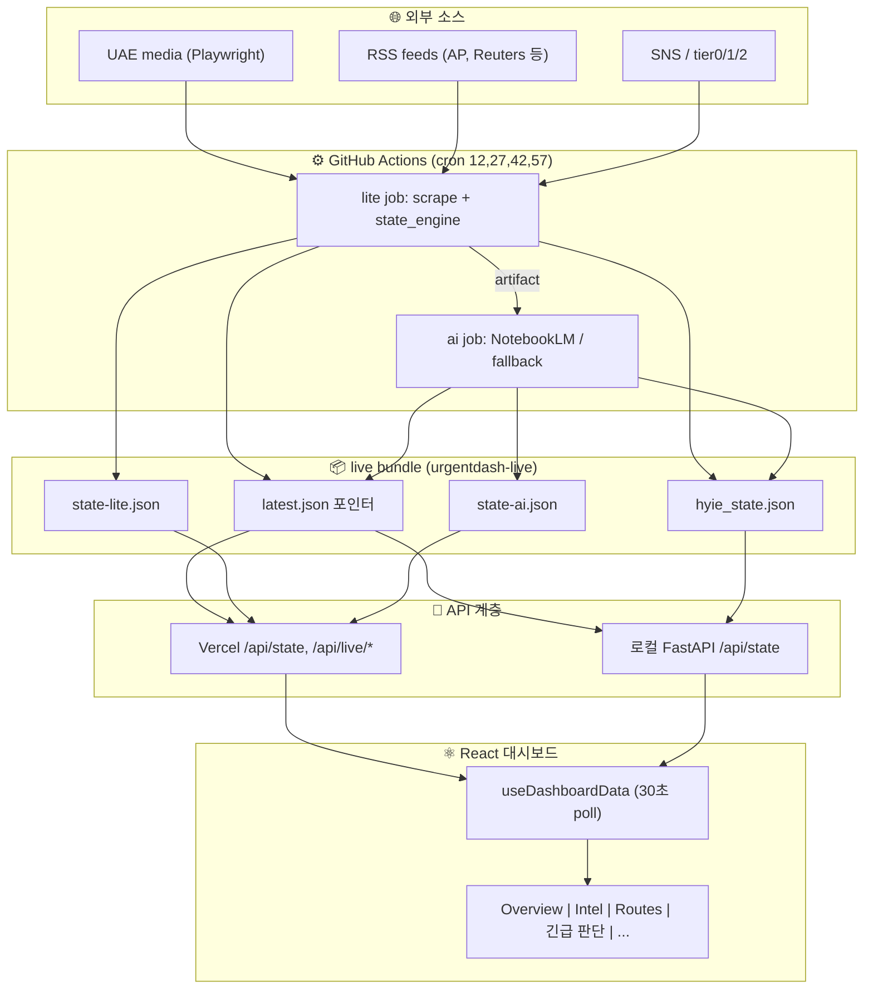
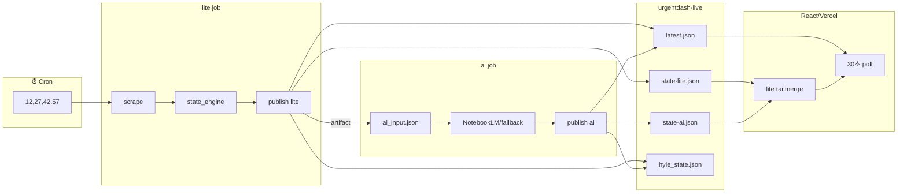
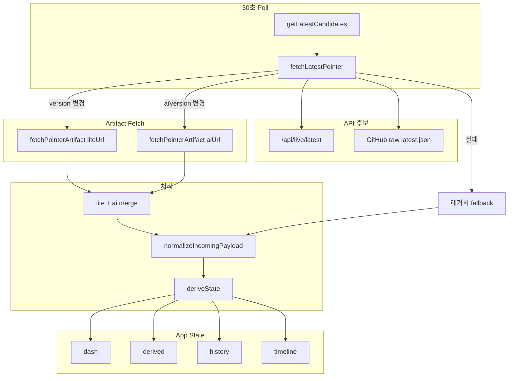

# UrgentDash Independent

이란·UAE 위기 대시보드용 실시간 전황 모니터링. HYIE 전황을 수집·분석·전달하고, React 대시보드에서 최신 상태, Intel Feed, 루트 정보, 긴급 판단 UI를 제공한다.

- **canonical 프론트엔드**: `react/` (Vite + React)
- **전달 경로**: `latest.json` 포인터 기반 lite+ai 병합 (30초 poll)
- **레거시**: `ui/index_v2.html` 호환용 유지
- **긴급 판단 탭**: 상황 선택 → 즉시 권고·추천 경로

---

## 전체 아키텍처 (Mermaid)



---

## 실행

### 사전 요구사항

| 항목 | 내용 |
|------|------|
| Python | 3.11+ (GHA도 3.11 사용) |
| Node.js | React 프론트엔드 빌드/실행 |
| pip 패키지 | `pip install -r requirements.txt` |
| Playwright | `playwright install chromium` (lite stage 스크래핑용, GHA에서는 자동 설치) |
| NotebookLM | AI enrich 시에만: `nlm login` (로컬), GHA secrets (원격) |

### 1. API + React 대시보드 (canonical)

`start_local_dashboard.ps1`은 **FastAPI health API(8000)**와 **React dev 서버(5173)**를 동시에 띄운다. 로컬에서 전체 스택을 한 번에 실행할 때 사용한다.

```powershell
.\start_local_dashboard.ps1
```

| 서비스 | URL | 설명 |
|--------|-----|------|
| API state | http://127.0.0.1:8000/api/state | lite+ai 병합 합성 payload |
| API latest | http://127.0.0.1:8000/api/live/latest | latest.json 포인터 |
| React UI | http://127.0.0.1:5173 | canonical 대시보드 |

**auto-refresh**: `/api/live/latest` 또는 `/api/state` 요청 시 `live/latest.json`이 없거나 stale(기본 1시간)이면 health API가 `run_lite_cycle()`를 직접 실행 후 최신 번들 반환. 별도 monitor 프로세스 없이 `start_local_dashboard.ps1`만으로도 1시간 이상 후 다음 poll에서 자동 수집된다. lock/cooldown/timeout은 `config.py`에 설정.

레거시 정적 UI는 필요할 때만 `ui/index_v2.html`을 직접 열어 호환 확인에 사용한다.

### 2. React (수동 실행)

API는 이미 다른 프로세스에서 돌고 있을 때, 프론트엔드만 따로 띄우는 경우.

```bash
cd react
npm install
npm run dev
```

React는 `VITE_LATEST_CANDIDATES` 또는 기본 후보(`/api/live/latest`, GitHub raw)를 30초마다 poll 한다.

### 3. 원샷 실행 (one-shot)

한 사이클만 실행하고 종료. CI/GHA와 동일한 로직.

```bash
# lite만 (스크래핑 + live 발행, AI 없음)
python scripts/run_now.py --mode lite

# full (lite + AI + 리포트)
python scripts/run_now.py --mode full --telegram-send

# AI만 (이미 lite 결과가 있을 때)
python scripts/run_now.py --mode ai --ai-input state/ai_input.json --telegram-send
```

### 4. long-run (스케줄러)

백그라운드에서 주기적으로 실행. 로컬 스케줄러 또는 API 전용 서버.

```bash
# 스케줄러 + API 동시 실행
python scripts/run_monitor.py

# API만 (8000 포트)
uvicorn src.iran_monitor.health:app --port 8000
```

상세: [의존성.md](./의존성.md) 참조.

## GitHub Actions

- **워크플로**: `.github/workflows/monitor.yml`
- **스케줄**: `12,27,42,57 * * * *` (15분 주기)
- **Gate**: scheduled run은 매 사이클 refresh 수행, freshness-based skip 없음
- **Job 1 (lite)**: scrape + state_engine → `live/latest.json`, `live/v/<version>/state-lite.json`, `live/hyie_state.json` 발행, artifact 업로드
- **Job 2 (ai)**: artifact 수신 → NotebookLM 또는 fallback 분석 → `state-ai.json` 발행, 7일 초과 version prune
- **공개 source of truth**: `origin/urgentdash-live/live/latest.json`

### GHA → Live → React 데이터 흐름 (Mermaid)



## 필수

- Python 3.11+, Node.js
- `requirements.txt` (`pip install -r requirements.txt`)
- Playwright 브라우저: `playwright install chromium` (GHA lite job에서 자동 설치, 로컬 원샷 실행 시 필요)
- NotebookLM 인증은 AI enrich에만 필요
  - 로컬: `nlm login`
  - GHA: `NLM_COOKIES_JSON`, `NLM_METADATA_JSON`

## 핵심 파일

| 파일 | 역할 |
|------|------|
| `live/latest.json` | version, liteUrl, aiUrl 등 포인터. React/Vercel이 30초마다 poll |
| `live/v/<version>/state-lite.json` | AI 없는 canonical snapshot (intelFeed, indicators, routes, metadata 등) |
| `live/v/<version>/state-ai.json` | 같은 version에 대한 AI patch payload |
| `live/hyie_state.json` | 레거시 호환 merge 결과 (lite+ai) |

## UI 탭 구성

| 탭 ID | 라벨 | 내용 |
|-------|------|------|
| overview | Overview | Gauge, Likelihood, Conflict Stats, 루트 요약 |
| analysis | Trends & Log | MultiLineChart, Sparkline, TimelinePanel |
| intel | Intel Feed | official→fresh→repeated 정렬, no-fresh 배너 |
| indicators | Indicators | 지표 I01~I07, Evidence Floor |
| routes | Routes | RouteMapLeaflet, 루트 상세 |
| sim | 긴급 판단 | 상황 선택 → 즉시 권고·추천 경로 |
| checklist | Checklist | 대피 체크리스트 |

상세 레이아웃: [LAYOUT.md](./LAYOUT.md), [COMPONENTS.md](./COMPONENTS.md)

### 프론트엔드 데이터 흐름 (Mermaid)



## 작업 트리 원칙

- `react/`와 `src/`가 현재 개발 기준이다.
- `ui/index_v2.html`과 `ui/hyie-erc2-dashboard.jsx`는 레거시 호환 경로다.
- `db/`, `reports/`, `urgentdash_snapshots/`, `live/v/`, `state/ai_input.json` 같은 로컬 runtime 산출물은 main 브랜치 기준 추적 대상에서 제외한다.

Vercel 배포본은 same-origin `/api/live/latest`, `/api/live/v/...`, `/api/state`를 우선 호출하고, 이 API들은 `macho715/iran_abu_dash@urgentdash-live`의 `live/` 아티팩트를 no-store 프록시한다. 대시보드 freshness 기준은 1시간이다.

운영 규칙:
- production upstream은 `macho715/iran_abu_dash@urgentdash-live`로 고정한다.
- Vercel production에는 `URGENTDASH_GITHUB_OWNER`, `URGENTDASH_GITHUB_REPO`, `URGENTDASH_PUBLISH_BRANCH`를 설정하지 않는다. 값이 있어도 프록시는 무시하고 오배치로 간주한다.
- Vercel 프로젝트 Git integration은 `macho715/iran_abu_dash`, root directory는 `react`여야 한다.

## 문서

- [SYSTEM_ARCHITECTURE.md](./SYSTEM_ARCHITECTURE.md)
- [Iran Abu Dash 운영 안정화 및 긴급 판단 UI 개편 종합 문서](./Iran%20Abu%20Dash%20운영%20안정화%20및%20긴급%20판단%20UI%20개편%20종합%20문서.md)
- [COMPONENTS.md](./COMPONENTS.md)
- [LAYOUT.md](./LAYOUT.md)
- [의존성.md](./의존성.md)
- [patchplan.md](./patchplan.md)
- [MERGE_HISTORY_2026-03-09.md](./MERGE_HISTORY_2026-03-09.md)
