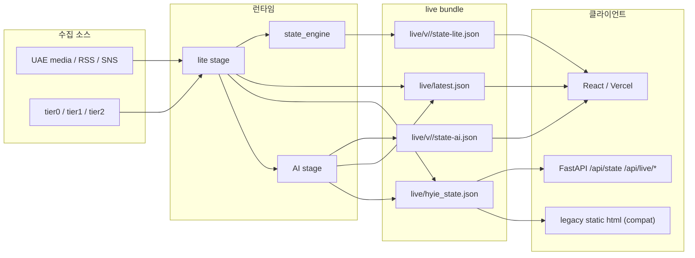
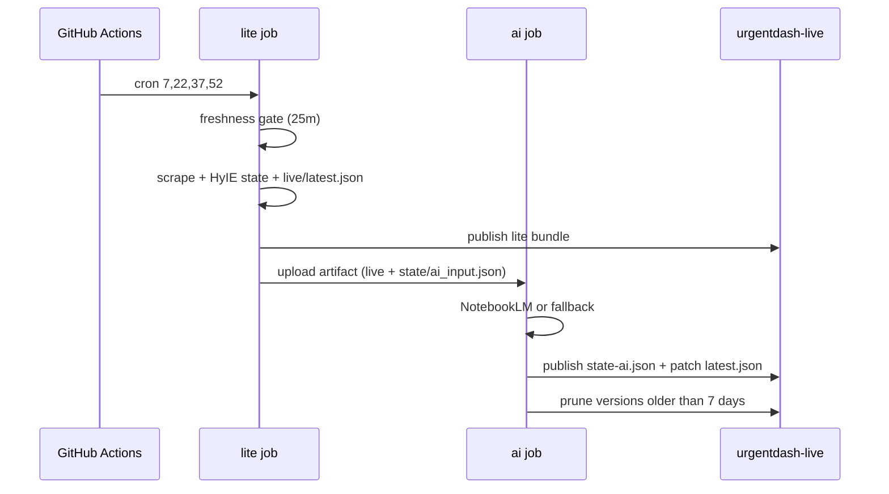

# UrgentDash System Architecture

## 1. 개요

| 항목 | 내용 |
|------|------|
| 프로젝트 | `iran_abu_dash` |
| 목적 | 이란·UAE 위기 대시보드용 실시간 상태 전달 |
| 발행 cadence | GHA overschedule + freshness gate |
| 대시보드 freshness 기준 | 1시간 stale / 2시간 severe / 4시간 critical |
| 공개 source of truth | `origin/urgentdash-live/live/latest.json` |
| 대시보드 전략 | `latest.json` fast poll, `state-lite.json`/`state-ai.json` lazy fetch |
| canonical 프론트엔드 | `react/` |

## 2. 전체 흐름



## 3. GitHub Actions



## 4. Live Bundle Layout

```text
live/
  latest.json
  hyie_state.json
  last_updated.json
  v/
    2026-03-06T05-27-22Z/
      state-lite.json
      state-ai.json
```

- `latest.json`
  - `version`, `collectedAt`, `stateTs`
  - `liteUrl`, `aiVersion`, `aiUpdatedAt`, `aiUrl`, `legacyUrl`
  - `status.lite`, `status.ai`
  - split health metadata (`lastLiteSuccessAt`, `lastAiSuccessAt`, ...)
- `state-lite.json`
  - 기존 HyIE snapshot schema 유지
  - `ai_analysis` 제외
- `state-ai.json`
  - 같은 `version`에 대한 AI patch payload
- `hyie_state.json`
  - 레거시 클라이언트용 merge 결과

## 5. 주요 모듈

| 파일 | 역할 |
|------|------|
| `src/iran_monitor/app.py` | lite stage / AI stage 분리, storage upsert, live publish |
| `src/iran_monitor/live_publish.py` | `latest.json`, versioned snapshots, compat file, prune |
| `src/iran_monitor/health.py` | `/health`, `/api/state`, `/api/live/latest`, `/api/live/v/...`, **요청 기반 auto-refresh** |
| `scripts/run_now.py` | `--mode full|lite|ai` CLI |
| `scripts/export_hyie_live.py` | 현재 state에서 live bundle 재생성 |
| `react/src/hooks/useDashboardData.js` | 데이터 획득·폴링·history/timeline·오프라인·알림·사운드 |
| `react/src/App.jsx` | 얇은 셸 (useDashboardData + 탭 라우팅) |

## 6. API

| 엔드포인트 | 설명 |
|------------|------|
| `GET /health` | lite/ai split health metadata 반환 |
| `GET /api/state` | `live/hyie_state.json` 기반 레거시 payload |
| `GET /api/live/latest` | 포인터 payload |
| `GET /api/live/v/{version}/{artifact}` | `state-lite.json` 또는 `state-ai.json` |
| `GET/POST /api/state/egress-eta` | 수동 이그레스 ETA |

**요청 기반 auto-refresh** (health.py): `/api/live/latest` 또는 `/api/state` 요청 시 `live/latest.json`이 없거나 오래됐으면 `run_lite_cycle()`를 직접 실행 후 최신 번들 반환. 별도 monitor 프로세스 없이 `start_local_dashboard.ps1`만으로 1시간 이상 stale 후 다음 poll에서 자동 수집. lock, cooldown, timeout은 `config.py`에 설정.

## 7. 로컬 실행

- `python scripts/run_now.py --mode lite`
- `python scripts/run_now.py --mode ai --ai-input state/ai_input.json --telegram-send`
- `python scripts/run_now.py --mode full --telegram-send`
- `python scripts/run_monitor.py`

## 8. 호환성 원칙

- React 앱(`react/`)이 canonical 프론트엔드다.
- 레거시 HTML(`ui/index_v2.html`)은 호환성 확인과 수동 fallback 용도로만 유지한다.
- Vercel은 same-origin `/api/live/latest`, `/api/live/v/...`, `/api/state`를 우선 호출하고, 이 API들은 `urgentdash-live` 브랜치의 `live/`를 no-store 프록시한다.
- `livePointer.js`는 구형 `latest.json` 포맷(`litePath`, `publishedAt` 등)을 `normalizeLatestPointer`에서 호환 처리한다.
- `/api/state`는 `live/hyie_state.json`을 우선 사용해 기존 소비자를 깨지 않는다.
