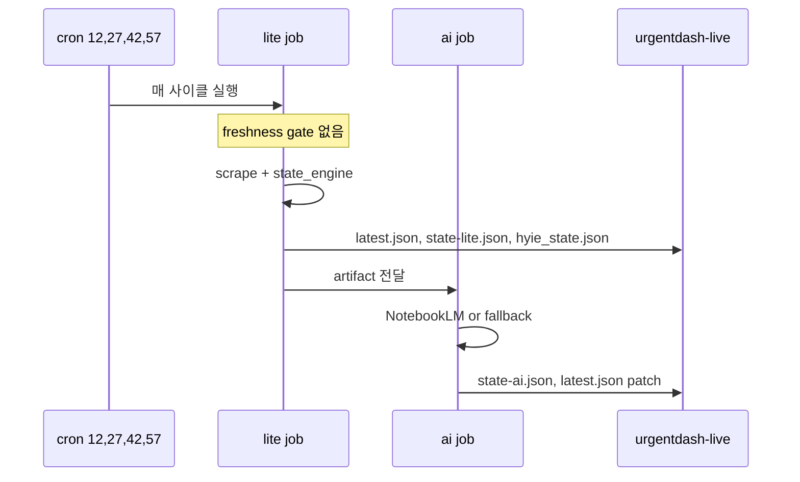

# UrgentDash 정보 소스 및 전달 경로

## 1. Source of Truth

- 공개 상태 파일은 `macho715/iran_abu_dash:urgentdash-live` 브랜치의 `live/` 디렉터리다.
- React/Vercel은 `live/latest.json`만 30초마다 확인한다.
- 레거시 소비자는 `live/hyie_state.json`을 계속 사용한다.

## 2. 전달 파일

| 파일 | 용도 |
|------|------|
| `live/latest.json` | 최신 version 포인터 |
| `live/v/<version>/state-lite.json` | AI 없는 canonical snapshot |
| `live/v/<version>/state-ai.json` | AI enrich 결과 |
| `live/hyie_state.json` | 레거시 호환 snapshot |
| `live/last_updated.json` | 운영용 보조 메타 |

## 3. GitHub Actions

- 워크플로: `.github/workflows/monitor.yml`
- 스케줄: `12,27,42,57 * * * *`
- Gate: scheduled run은 매 사이클 refresh, freshness-based skip 없음
- `lite` job
  - scrape
  - `state/hyie_state.json` 갱신
  - `live/latest.json`, `live/v/<version>/state-lite.json`, `live/hyie_state.json` 발행
  - `state/ai_input.json` artifact 업로드
- `ai` job
  - `state/ai_input.json` 읽기
  - NotebookLM 또는 fallback 분석
  - `live/v/<version>/state-ai.json` 발행
  - `latest.json`과 `live/hyie_state.json` patch
  - 7일보다 오래된 version prune



## 4. 로컬 실행

### API + React 대시보드
```powershell
.\start_local_dashboard.ps1
```

`/api/live/latest` 또는 `/api/state` 요청 시 `live/latest.json`이 없거나 오래됐으면 health API가 `run_lite_cycle()`를 직접 실행 후 최신 번들 반환한다. 별도 `run_monitor.py` 없이 `start_local_dashboard.ps1`만으로 1시간 이상 stale 후 다음 poll에서 자동 수집된다. lock/cooldown/timeout은 `config.py`에 설정된다.

기본 UI는 React dev 서버(`http://127.0.0.1:5173`)다. `ui/index_v2.html`은 레거시 호환 확인용으로만 유지한다.

### one-shot
```bash
python scripts/run_now.py --mode lite
python scripts/run_now.py --mode ai --ai-input state/ai_input.json --telegram-send
python scripts/run_now.py --mode full --telegram-send
```

### long-run
```bash
python scripts/run_monitor.py
uvicorn src.iran_monitor.health:app --port 8000
```

## 5. 프론트엔드 후보 순서

1. `VITE_LATEST_CANDIDATES` 또는 기본값
   - `http://127.0.0.1:8000/api/live/latest`
   - `/api/live/latest`
   - `https://raw.githubusercontent.com/macho715/iran_abu_dash/urgentdash-live/live/latest.json`
2. 최신 포인터가 실패하면 legacy fallback
   - `VITE_DASHBOARD_CANDIDATES`
   - `VITE_FAST_STATE_CANDIDATES`
   - `live/hyie_state.json` 또는 `/api/state`

Vercel 배포본의 `/api/live/latest`, `/api/live/v/...`는 `urgentdash-live` raw를 no-store 프록시한다. `/api/state`는 `latest.json` 포인터를 읽어 lite·ai 아티팩트를 fetch한 뒤 병합한 payload를 반환하는 합성 API이다.

## 6. GHA Secrets

| 구분 | Secret | 용도 |
|------|--------|------|
| NotebookLM | `NLM_COOKIES_JSON`, `NLM_METADATA_JSON` | AI stage NotebookLM 인증 |
| Storage | `DATABASE_URL`, `STORAGE_BACKEND` | Postgres 백엔드 (없으면 SQLite fallback) |
| Telegram | `TELEGRAM_BOT_TOKEN`, `TELEGRAM_CHAT_ID` | AI stage 리포트 전송 |
| WhatsApp | `TWILIO_ACCOUNT_SID`, `TWILIO_AUTH_TOKEN`, `TWILIO_WHATSAPP_FROM`, `WHATSAPP_RECIPIENTS` | WhatsApp 알림 (선택) |
| AI 제어 | `PHASE2_ENABLED`, `APPROVE_SEND` | AI stage NotebookLM 사용 여부, 비대화형 전송 허용 |

NotebookLM이 없어도 lite stage는 계속 발행된다. AI stage는 NotebookLM 실패 시 rule-based fallback으로 `state-ai.json`을 쓴다.

로컬 NotebookLM: `nlm login`

## 7. 런타임 요구사항

- Python 3.11+ (GHA도 3.11 사용)
- Node.js (React 프론트엔드)
- `requirements.txt` (pip 패키지 목록)
- `pip install -r requirements.txt`
- Playwright chromium: `playwright install chromium` (GHA lite job, scrapers에서 사용)

## 8. 수동 갱신

```powershell
.\refresh_live_state.ps1
```

또는

```bash
python scripts/update_hyie_state_now.py
python scripts/export_hyie_live.py --out-dir live
```

## 9. 문제 해결

| 증상 | 확인 사항 | 조치 |
|------|-----------|------|
| `/api/live/latest` 404 | `live/latest.json` 미생성 | `run_now --mode lite` 또는 `export_hyie_live.py` 실행 |
| AI가 붙지 않음 | `state/ai_input.json`, `NLM_COOKIES_JSON` 확인 | `run_now --mode ai` 재실행 |
| React가 legacy fallback으로 내려감 | `latest.json` 후보 URL, CORS, raw URL 확인 | `/api/live/latest` 또는 `urgentdash-live` raw 확인 |
| schedule가 너무 자주 도는 것처럼 보임 | GHA gate 확인 | scheduled run은 매 사이클 refresh. skip 없음. |
| 레거시 UI가 비어 있음 | `live/hyie_state.json` 확인 | lite/ai publish 또는 수동 export 실행 |

## 10. Vercel 운영 규칙

[README.md](./README.md) 참조. 요약:

- production upstream: `macho715/iran_abu_dash@urgentdash-live` 고정
- Vercel production에 `URGENTDASH_GITHUB_*`, `URGENTDASH_PUBLISH_BRANCH` 설정하지 않음
- Git integration: `macho715/iran_abu_dash`, root directory: `react`

## 11. 관련 문서

- [README.md](./README.md)
- [SYSTEM_ARCHITECTURE.md](./SYSTEM_ARCHITECTURE.md)
- [Iran Abu Dash 운영 안정화 및 긴급 판단 UI 개편 종합 문서](./Iran%20Abu%20Dash%20운영%20안정화%20및%20긴급%20판단%20UI%20개편%20종합%20문서.md)
- [COMPONENTS.md](./COMPONENTS.md)
- [LAYOUT.md](./LAYOUT.md)
- [patchplan.md](./patchplan.md)
